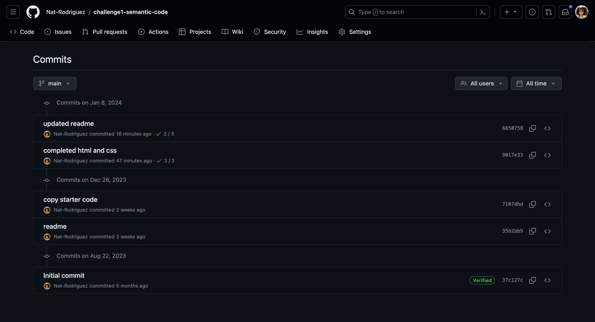

# 1-challenge-semantic-code

Refactor starter code with semantic html

# challenge1-semantic-code

## Task

I have refactored starter code with semantic html in order to make it more accessible while retaining its functionality and appearance.

This includes:

- Ensuring the elements follow a logical structure independent of styling and positioning

- Ensuring classes are titled concisely

- Ensuring the css aligns with the changed html

## Tech Used

- The starter code was assigned by Columbia Engineering Coding Boot Camp.

- HTML

- CSS

## Screenshots

## Deployed Application

[The link to the deployed application can be found here here!]

## Notes

I had originally copied the entire "Develop" folder for the starter code, which we were explicitly stated not to do, but I had forgotten after not working on the assignment after a hiatus. I had decided to create a new repository in order to mitigate the damage, and as such, previous commits are not shown.

Here lies the previous repository commits:

